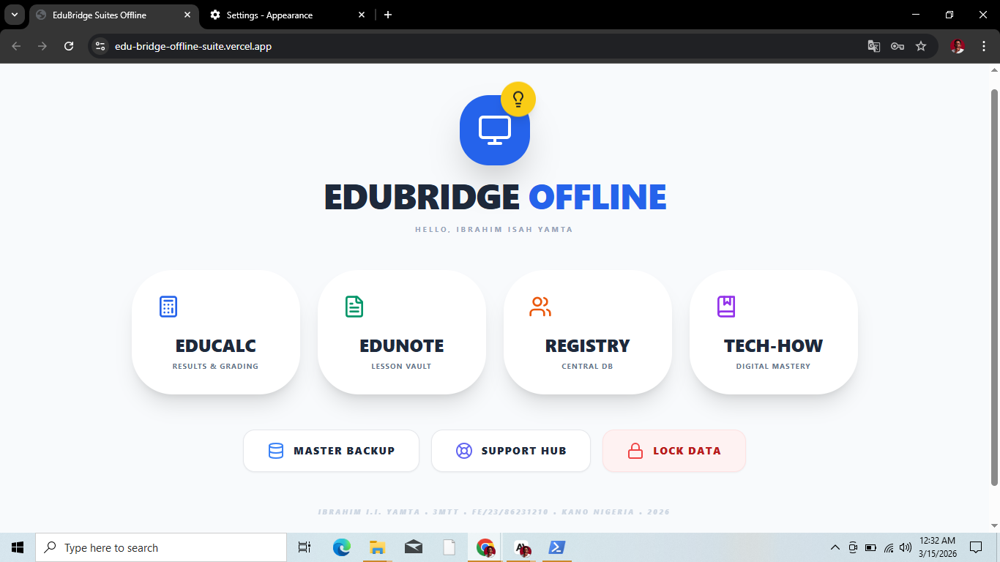
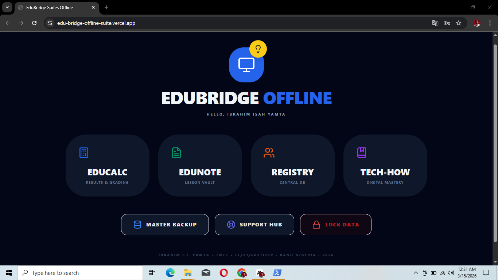

EduBridge Offline Suite
| Main Dashboard Light Mode | Main Dashboard Dark Mode |
|  |  |

    
    

Empowering Nigerian Educators through high-performance digital infrastructure. EduBridge Offline Suite is a centralized, offline-first workspace designed to automate grading, structure lesson planning, and provide essential digital literacy training for teachers.

Developed by Ibrahim Isah Yamta. 3MTT Fellow. FE/23/86231210 (Kano, Nigeria).

🚀 Core Modules

1. 📊 EduCalc Engine

A specialized grading system aligned with Nigerian Secondary and Primary Education standards.

Automated Grading: Input CA1, CA2, and Exam scores; the system automatically calculates totals and assigns grades (A, B, C, D, E, F).

Archive Tracking: Saves registers locally with Last Modified timestamps.

Data Portability: Export results directly to Excel-ready CSV files.

2. 📝 EduNote Vault

A 12-week structured lesson planning system integrated with the Nigerian National Curriculum.

Curriculum Database: Includes comprehensive schemes for Primary (1-5), Junior Secondary (JSS 1-3), and Senior Secondary (SS 1-3) subjects.

Workspace: Rich text workspace with support for draft loading from curriculum topics.

Multi-Format Export: Save your prepared notes as professional PDFs or Microsoft Word (.doc) files.

Vault History: Every note saved in the 12-week vault displays its Last Modified time for easy version tracking.

3. 👥 Student Registry Database

A centralized database that eliminates the need for manual typing during result entry.

Load Once, Use Everywhere: Register student names and assigned classes once.

Smart Normalization: The engine automatically treats variations like ss1, SS 1, and ss 1 as the same class.

Auto-Populate: When starting a new register in EduCalc, the system automatically detects the class and imports the corresponding names from the Registry.

4. 💡 Tech-How Mastery

A digital skills training library tailored for the modern classroom.

Hardware Care: Guides on computer maintenance and projector setup.

OS Shortcuts: Vital keyboard shortcuts to increase teacher efficiency.

AI Prompt Architect: Copyable expert prompts for generating lesson plans and exam questions using AI.

🛠️ Key Technical Features

100% Offline-First: All data is persisted locally via localStorage. No internet connection is required for daily operations.

Stable Navigation: Synchronized browser history logic ensures that the "Back" button works intuitively without looping into exited modules.

Privacy Gatekeeper: Hardware-persisted locking system with a master password to protect sensitive student data.

Master Backup: Full-state JSON serialization allows you to export your entire database (Profiles, Registry, Notes, and Registers) and restore it on any other device.

Auto-Category Detection: The system intelligently identifies if a class belongs to Primary, Junior, or Senior schemes based on the class name input.

💻 Tech Stack

Framework: React

Styling: Tailwind CSS (Modern, responsive UI)

Icons: Lucide React

Deployment: Offline Immersive / GitHub Pages

🔧 Installation & Usage

Clone the repository:

git clone [https://github.com/IBI-Yamta/EduBridge_Offline_Suite.git](https://github.com/IBI-Yamta/EduBridge_Offline_Suite.git)

Install dependencies:

npm install

Run locally:

npm start

📞 Support Hub

Direct technical assistance integrated via Call, SMS, WhatsApp, and Email.

Developer: Ibrahim Isah Yamta (IB TECHIFIED). 3MTT Fellow. FE/23/86231210

Location: Kano, Nigeria

Contact: +234 703 0385 554

Email: iiyamta43@gmail.com

© 2026 FE/23/86231210 (IB TECHIFIED). Empowering the 21st-Century Nigerian Teacher.
